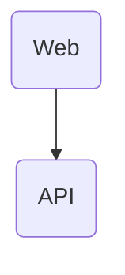

# Architecture

## Overview

A web app consuming data from the LibTaste API.

## Modules / Components

| Module         | Responsibility                                     | Path                                                            |
|----------------|----------------------------------------------------|-----------------------------------------------------------------|

## Data flow

1. Authenticate user through Steam
2. Create population from their steam library (or load from persistence)
3. Expose the following actions:
   - Select winner of pairwise game comparisons
   - Show user library leaderboard
   - Show global game leaderboard

## Tech stack & rationale

| Choice                      | Alternative considered  | Why this choice                                                                    |
|-----------------------------|-------------------------|------------------------------------------------------------------------------------|

## Non-Functional Requirements (NFRs)

### Compatibility

- The web app needs to comply with the specification defined under `openapi/openapi.yaml`

### Maintainability

- Functional requirements are covered by function tests
- Always prefer deleting or consolidating lines over adding new blocks
  - write the minimum code required to pass the test or feature spec
- Whenever you touch a file, remove any unused imports, legacy comments, and dead functions inside it
- README.md files of impacted packages are kept up-to-date

### Security

## Architectural decisions

Detailed rationale for individual decisions: see `docs/adr/`.
