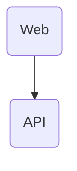

# Architecture

## Overview

A web app consuming data from the LibTaste API.

## Modules / Components

| Module         | Responsibility                                     | Path                                                            |
|----------------|----------------------------------------------------|-----------------------------------------------------------------|
| Web application | React SPA, routes, session UI, and feature boundaries | `apps/web/src/` |
| API contract | Versioned HTTP interface consumed by the web client | `openapi/openapi.yaml` |
| Generated web contract | TypeScript representation generated from OpenAPI | `apps/web/src/api/generated.ts` |
| Static runtime | Nginx route fallback, runtime config, health, compression, and headers | `apps/web/nginx/`, `apps/web/docker/` |

## Data flow

1. Authenticate user through Steam
2. Create population from their steam library (or load from persistence)
3. Expose the following actions:
   - Select winner of pairwise game comparisons
   - Show user library leaderboard
   - Show global game leaderboard

## Tech stack & rationale

| Choice                      | Alternative considered  | Why this choice                                                                    |
|-----------------------------|-------------------------|------------------------------------------------------------------------------------|
| React + Vite SPA | Server-side rendering | Authenticated product routes do not need search rendering; a static artifact keeps runtime and rollout small. |
| React Router | Hand-written history routing | Declarative public/protected route ownership and reliable SPA fallback. |
| TanStack Query | General global state store | Server state receives caching and cancellation semantics while auth remains a small context. |
| Runtime `config.json` | Build-time environment variables | One verified image can move between environments without rebuilding or embedding secrets. |
| In-memory access token + protected refresh cookie | Browser token persistence | Limits JavaScript-accessible credential lifetime and delegates refresh protection to HttpOnly/SameSite cookies. |

## Non-Functional Requirements (NFRs)

### Compatibility

- The web app needs to comply with the specification defined under `openapi/openapi.yaml`

### Maintainability

- Functional requirements are covered by function tests
- Always prefer deleting or consolidating lines over adding new blocks
  - write the minimum code required to pass the test or feature spec
- Whenever you touch a file, remove any unused imports, legacy comments, and dead functions inside it
- README.md files of impacted packages are kept up-to-date

### Security

- Browser access tokens are retained only in memory; refresh credentials remain in protected cookies.
- Web refresh requests use credentialed exact-origin requests and echo the readable CSRF cookie.
- The static server applies a restrictive Content Security Policy and standard browser security headers.
- Runtime configuration is non-secret and validated before product or authentication requests start.

## Architectural decisions

Detailed rationale for individual decisions: see `docs/adr/`.
